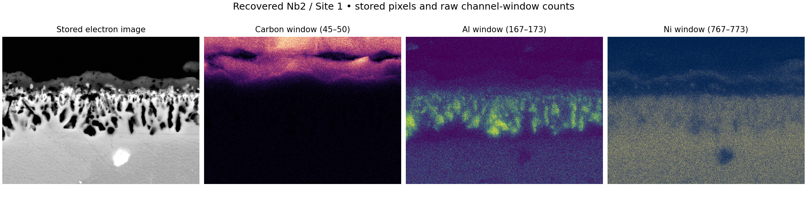

# Open recovery of archived AZtec microscopy measurements

This package restores open access to native EDX measurements deposited by **Jackson Wo, Mark Hardy and Howard Stone** for their nickel-superalloy oxidation research: [Cambridge dataset, DOI 10.17863/CAM.97038](https://doi.org/10.17863/CAM.97038).

The primary measurement recovery covers **18 stored spectra, nine complete spectral maps, 135 stored images and 18 time planes**. All 371 original archive members were acquired and checked. Every map's pixel counts reproduce its stored spectrum in all 2,048 channels; all 177 image-pyramid comparisons are exact. [recovery-summary.json](recovery-summary.json) records the final scope and checks.

**This completes recovery of the primary measurement arrays, not interpretation of every proprietary field.** Quantification/calibration blobs and one unreferenced DAT are preserved intact but remain partly opaque. No universal AZtec reader, independently calibrated energy scale, or reproduction of the paper's conclusions is claimed.



This new visualization comes from `reanalyse.py`; each panel has its own 99th-percentile display ceiling. Element labels indicate approximate energy windows, not quantified compositions.

## Use the data

Download **recovered-data-v1.zip** from this repository's **Releases** page for all nine map HDF5 files, `images.h5`, CSV, metadata and integrity manifests. The [spectra CSV](recovered/spectra.csv) and [metadata](recovered/metadata.json) are also available directly here. Source and derived measurements retain **CC BY 4.0**, with attribution to Wo, Hardy and Stone.

Each map HDF5 contains sparse `channel`, `pixel`, `count` arrays per tile. Add the tile's x/y offsets to its local row-major coordinates. All image pyramid levels retain their original values and labels. [FORMAT.md](FORMAT.md) documents the layouts and uncertainty; `window_map` in `reanalyse.py` demonstrates arbitrary channel-window integration using only open HDF5 data.

## Why this qualifies

The [source record](https://www.repository.cam.ac.uk/items/54dabeea-836d-4752-be7f-1d68d43b8568) says the EDX data require proprietary AZtec despite an open reuse licence. The blocked task is reanalysis of authentic deposited measurements.

The longstanding [RosettaSciIO native Oxford-reader discussion](https://github.com/hyperspy/rosettasciio/issues/97) documents demand and overlapping work. In July 2026 a contributor reported an HDF5 converter tested on AZtec 2.3/2.4 and sought newer fixtures; maintainers described native access as useful. No released implementation was linked there when checked on 4 October 2026. Ripple workflows require a prior vendor export; the H5OINA reader discussed there covers EBSD and does not establish native EDS access. This package is a licensed recovery and validation fixture for such efforts, not a claim that no other converter exists.

The associated [paper](https://doi.org/10.1007/s11085-023-10218-7) investigates Nb, Ta and Ti effects on oxidation of Ni-based superalloys. Its bulk-composition table cannot directly validate these post-oxidation map-sum spectra.

## Verification and limits

- All native members have size/CRC and SHA-256 records. The 370 DATs comprise 216 spectral tiles, 18 time planes, 126 X-ray images, nine electron images and one unreferenced preserved member. No whole-original-ZIP SHA is claimed.
- All 442,368 tile-channel planes are checked against their stored totals and re-encoded byte for byte. Every spatial pixel is covered once. All nine map sums match the stored spectra across 18,432 channel comparisons. HDF5 arrays are read back and compared to decoded arrays.
- All 177 image reductions reproduce the expected 2×2 averaging exactly. A separate Nb2 carbon-image check supports the spatial orientation: correlation 0.99617; interior-channel normalization agrees within 0.0009765625 intensity units on 616,750 pixels. Flipped and column-major alternatives fail that comparison.
- Stored doubles imply `E_eV = 10 × channel − 200`. All 54 Al/Cr/Ni peak checks pass within 30 eV, maximum residual 18.253 eV, against NIST KL3 values for [Al](https://physics.nist.gov/cgi-bin/XrayTrans/search.pl?element=Al&lower=&units=eV&upper=), [Cr](https://physics.nist.gov/cgi-bin/XrayTrans/search.pl?element=Cr&lower=&units=eV&upper=) and [Ni](https://physics.nist.gov/cgi-bin/XrayTrans/search.pl?element=Ni&lower=&units=eV&upper=). This checks gross interpretation, not metrological accuracy; EDS blends KL2/KL3.
- Separate read-only agents independently decoded the stored spectra and first complete map, and checked image pyramids and spatial alignment. These are agent checks, not external human or vendor validation.

Beam energy, physical pixel scale, vendor quantification outputs, fractional end-channel image weighting and some auxiliary meanings remain undecoded. Live/real seconds are inferred from filenames, totals and normalization, not independently export-verified. Schema `18.0` is not an AZtec application version. The original OIP and complete database export preserve information beyond the interpreted arrays.

## Reproduce

Python 3.12 was used. Install pinned dependencies locally. **Do not use Python `-O`; integrity assertions must stay enabled.**

```powershell
python -m venv .venv
.\.venv\Scripts\python.exe -m pip install -r requirements.txt
.\.venv\Scripts\python.exe restore_export.py
.\.venv\Scripts\python.exe extract_spectra.py
.\.venv\Scripts\python.exe fetch_members.py --all
.\.venv\Scripts\python.exe extract_maps.py --all
.\.venv\Scripts\python.exe extract_images.py
.\.venv\Scripts\python.exe reanalyse.py
.\.venv\Scripts\python.exe validate_recovery.py
```

Other platforms can use `.venv/bin/python`; only Windows execution has been tested here. Allow about 3 GB for native inputs and exports, plus the environment and optional release ZIP. The source archive is fetched through checked member ranges; cached members are checked on reuse.

To regenerate the database export from the original OIP, use **Windows x64 / Windows PowerShell 5.1**: run `acquire.py`, then `powershell.exe -NoProfile -File read_oip.ps1`. The pinned official SQL Server Compact package stays local; read its EULA before use. Microsoft binaries are not redistributed. `restore_export.py` restores the checksum-pinned public export without SQLCE. Binary XML is read as XML; application objects are never executed.

## Attribution

Original measurements and scientific research: **Jackson Wo, Mark Hardy and Howard Stone**, [dataset DOI](https://doi.org/10.17863/CAM.97038). [SOURCE.md](SOURCE.md) records rights and transformations. Autonomous AI research agents using OpenAI Codex performed the recovery, implementation and checks. We do not represent OpenAI. No human technical authorship or external human review is implied. Code and dependency terms are described in [LICENSE](LICENSE).
